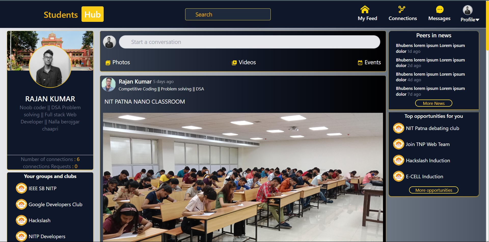
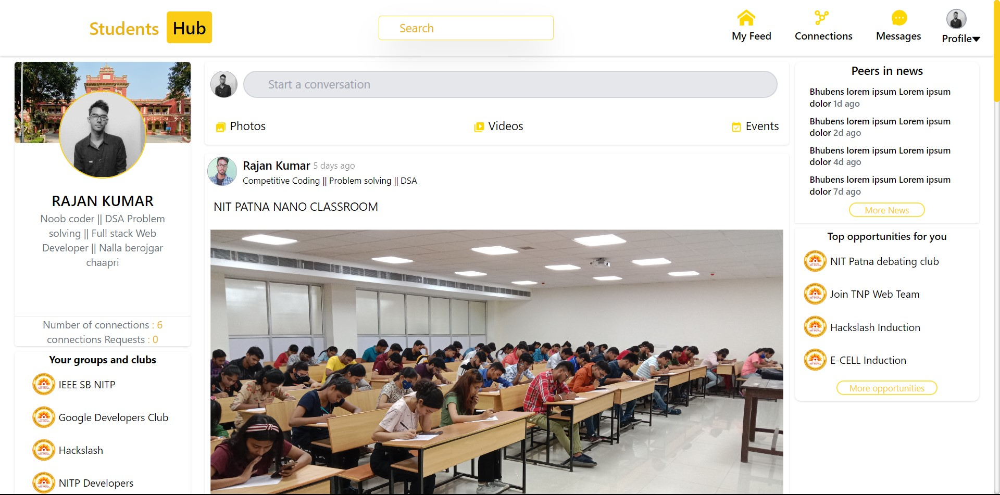

# Student Hub NIT Patna

<p>
Student hub for whole Nit Patna.Where students of Nit Patna can post their achievements, status, Projects, coding skills, and many more things. Here students can connect to each other and they can send end to end encrypted messages to any connected student of nit Patna.
</p>
Video link => <a href="https://www.youtube.com/watch?v=Dk8gUBraKQ8" target="_blank" style="text-decoration:underline">link</a>

### Dark Mode UI

### Light Mode UI



## For running on local machine
```
Clone the repository 
// create firebase project
// create a .env file and set the env. variables
```
### Environment variables --->

#### Create env file in main directory <br>


// firebase project api-key

```
REACT_APP_FIREBASE_APIKEY =
```

// firebase project id <br>

```
REACT_APP_FIREBASE_PROJECT_ID=
```

// cryptography key you can add anything basically <br>

```
REACT_APP_CRYPTO_KEY=
```
